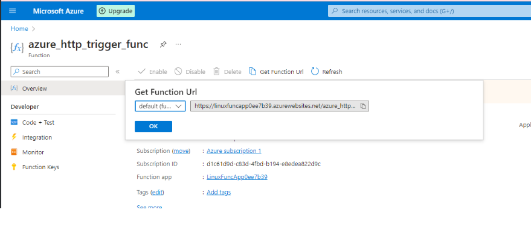
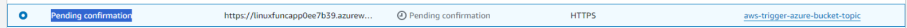
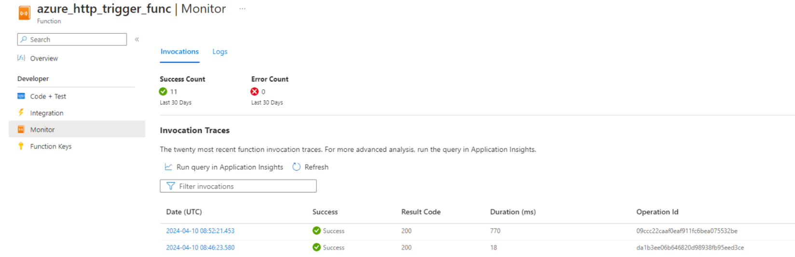

### Prerequisites

For this project you should have installed [Pulumi](https://www.pulumi.com/docs/install/),
[AWS CLI and credentials](https://www.pulumi.com/registry/packages/aws/installation-configuration/#credentials), 
[Azure CLI or another option to authenticate](https://www.pulumi.com/registry/packages/azure-native/installation-configuration/#authentication-methods)

Create a new stack:
```
pulumi stack init azure
```
and
```
pulumi stack init azure
```

install requirements
```
pip install -r .\requirements.txt
```

Then you can implement using all infrastructure if this project:
```
pulumi up
```

To see stacks and the current one:
```
pulumi stack ls
```

To choose particular stack:
```
pulumi stack select stackname
```

In this project are two stacks: aws and azure. 
You should start to deploy from azure to create function.
and then switch to aws stack and deploy it. 

You also need to change value of all needed values in Pulumi.aws.yaml.

### Description of The Project

Here is declared the infrastructure that connects Azure function with AWS S3 objects appearing or deleted in S3.

This project has two stacks: azure and aws. You should deploy azure stack and then aws.

Before deploying aws stack firstly you should create all resources except of bucket_notification. Let deploy it after all resources.
Also you should get your Azure Function url to insert it in azure_triggered_by_aws:azure_function_url: in Pulumi.aws.yaml.
You can find it here on Portal in Functions menu of Function App resource

After creating AWS Topic Subscription you can find your Subscription is in pending status
You should go to Azure portal to the Monitor tab and press the request. 
In the body of Json find "SubscribeURL" value.
Go to AWS Topic Subscription. Choose it and press "Confirm Subscription". Insert the value of SubscribeURL.

Deploy bucket_notification resource. Now your function could be triggered with S3 objects uploading or deleting!